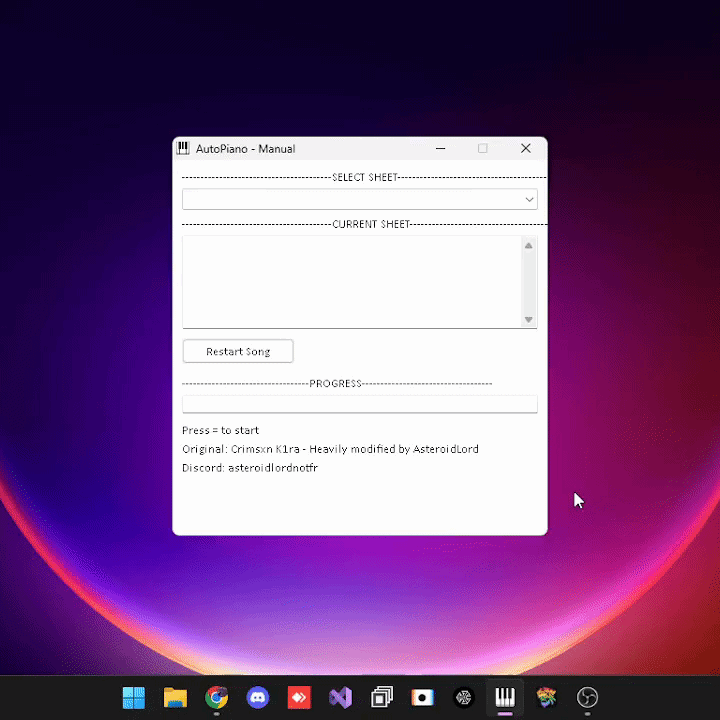

# 🎹 VPlayer
A simple, open-sourced Virtual Piano autoplayer which you can use for sites or games like Roblox.

When a sheet is loaded, click the = or - key to start playing your selected sheet.
It comes with 30+ sheets built-in but also functionality to add your own via txt files. It even supports categories!

## ⚠️ Notes
- Do not Alt-Tab while your playing or while not having a VP site open. It could press unwanted keys.
- Look at a sheet before using it, it could do unwanted things such as running CMD.
- Different piano games/sites may use different key layouts.

📜 Disclaimer

This project is for educational and personal use only.
Only **you** are responsible for how **you** use it.

Any moderated actions took on your account is not my issue, that's yours.
<small>This project was made with [AutoHotkey](https://www.autohotkey.com/v2/)</small>
